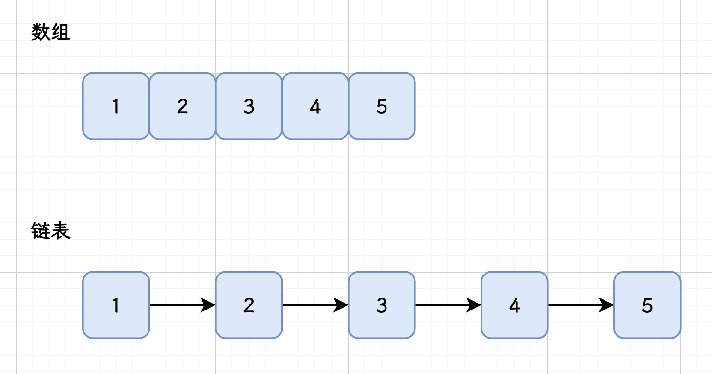
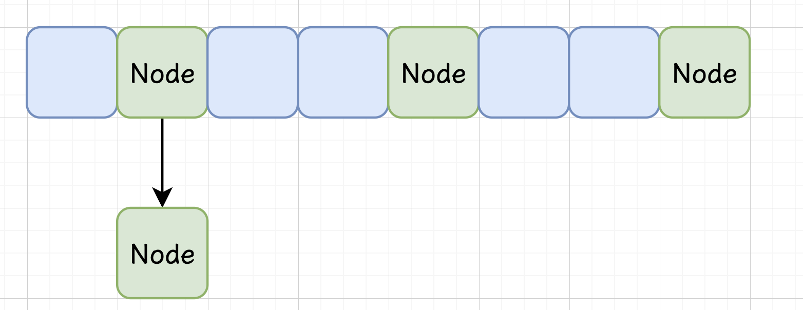
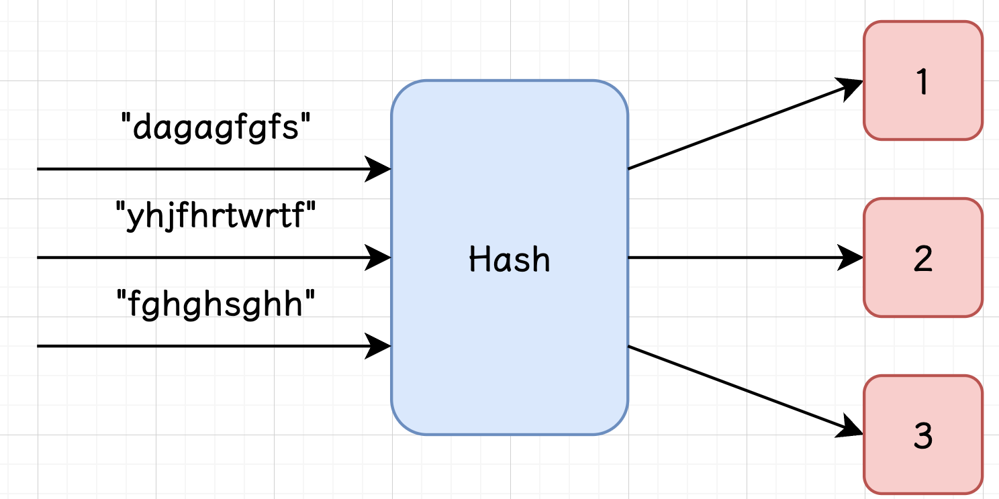
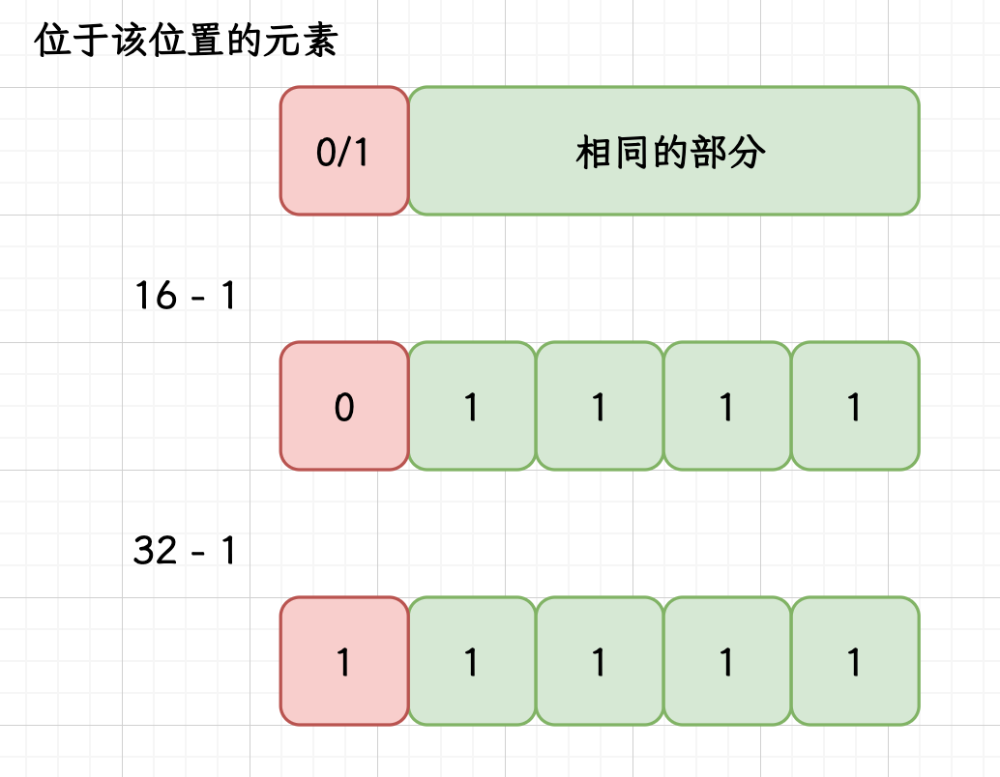
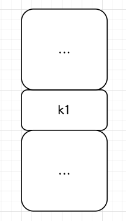
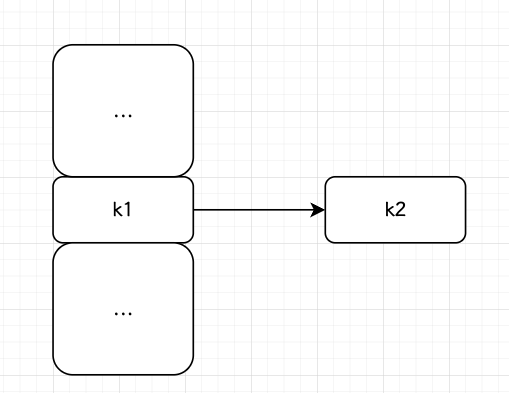
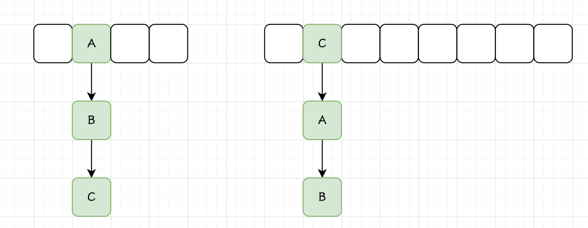
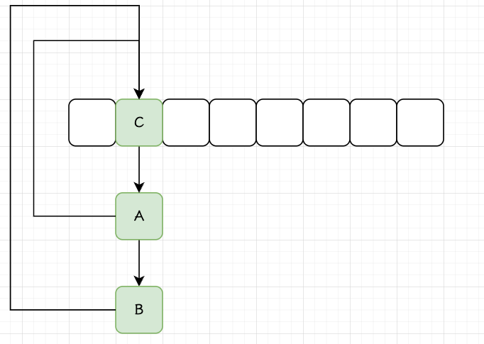

---
author: Ryan Yuan
title: HashMap 核心源码超详细解析
date: 2024-12-15
image: image.png
---   
          
# 散列表与哈希算法         
## 数组和链表         
         
==数组==：数组是一种 **线性数据结构**，由一组连续的内存单元组成，每个元素都有固定的 **索引** 位置。         
数组的优点是 **可以通过索引快速访问元素**，访问元素的时间复杂度为O(1)。         
但是因为数组的长度是指定的，所以进行插入和扩容的操作非常麻烦，需要将原本数组中的内容转移到新数组中才能完成扩容的操作。         
         
==链表==：链表也是一种线性数据结构，由一系列节点组成，每个节点包含一个数据元素和一个指向下一个节点的指针。         
链表的优点是 **插入和删除操作** 可以在O(1)时间内完成，无需移动其他元素。         
缺点是访问元素时需要 **遍历整个链表**，时间复杂度为O(n)，并且相比数组占用更多的内存空间。         
## 散列表         
        
与上面的两种数据结构不同的是，散列表是用来 **存储键值对** 的，在实现方式上，散列表像是数组 + 链表的一个结合，也就是基本的结构是一个数组，但数组中存储的元素是一个链表（本文仅讨论链地址法）。         
提到数组，最显著的特点就是索引，散列表是通过 **哈希算法** 将键映射成一个长度固定的二进制数，然后通过 **路由算法** 将其映射到数组的索引中；         
这样做了之后，如果我们在想要寻找这个被存储的元素，只需要通过相同的 key -> 哈希算法 -> 路由算法 的方式，就可以得到数组中的唯一一个索引。         
         
通过这样的方式，散列表拥有了和链表一样快的插入速度，也有了可以媲美数组的查询速度，但是一切使用哈希算法的结构都不可避免的会遇到哈希冲突，即不同的 key 经过映射之后得到了相同的结果，需要解决冲突的方法，链地址法、开放散列法等；         
         
在 HashMap 中使用的是优化之后的链地址法，即在数组的某个位置存储的是一个链表结构，如果遇到哈希冲突就将这些元素链接起来；与传统的链地址法不同的是，HashMap 的链地址法当某个位置链表过长的时候，会将这个链表转化为一个红黑树。         
## 哈希算法         
   
Hash 的中文释义为散列，一般音译为哈希。哈希算法的功能是将 **任意长度** 的输入，通过算法转变为固定长度的输出。         
映射的规则称为 **哈希算法**，原始数据通过映射之后得到的二进制串就是 **哈希值**。         
         
哈希算法有如下的几个特点：         
- 无法通过哈希值反推出原始的数据，且数据一点微小的变化都会得到完全不同的哈希值，相同的数据会得到完全相同的哈希值，这两个特点使得哈希算法在安全方面有广泛的应用，比如 https 的数字证书的签名认证。         
- 哈希算法的执行效率很高效，长文本也能很快的算出对应的哈希值。         
- 由于是将任意长度是输出映射为固定长度的输出，将无限种数据映射为有范围的数据，必然会导致冲突，这也就是我们常说的 **哈希冲突**。如何处理哈希冲突是使用哈希函数的时候需要解决的问题。         
# HashMap 实现概览         
## 数据结构         
Java 中的 HashMap 就是基于 **散列表** 实现的，其底层是通过数组+链表（Java8 引入了红黑树）来存储数据的。         
HashMap 内部维护了一个数组，它是 HashMap 实例的一个成员变量，名为 table，这个数组的每个位置称为桶（Bucket）。 初始的数组长度如果不指定的话默认为 16，当插入元素过多的时候，HashMap 会使用一个更大的数组替换原来的 table，然后将原本 table 中的元素重新映射到这个新的数组。         
         
Java 8 之后，HashMap 使用了数组 + 链表 + 红黑树的结构，以应对哈希冲突。每个桶可以存储一个链表或红黑树。         
当哈希冲突发生时，新的键值对会被插入到对应位置的链表或红黑树中，具体来说，当某个链表的长度超过一定阈值（默认为8），且 table 的长度超过某个阈值（默认为 64）的时候，这个长链表会转换为红黑树，以提高查找、插入、删除操作的效率；红黑树是一种二叉查找树，它的查找时间复杂度为 O(log n) ，链表则是 O(n)。         
## 路由算法         
通过 Object#hashCode 得到的整数可能无法直接作为数组，Object#hashCode 方法的结果是 int 类型，它表示的值有很大可能超过此时数组的长度，此时就需要再经过一次映射来将哈希值转化到数组下标范围内。         
HashMap 将键映射为索引是通过了如下的步骤，比如说通过 map.put("key", "value") 插入一个键值对，         
首先通过调用 String 的 hashCode 方法，将 "key" 这个字符串映射为一个 32 位整数，对这个整数做一些处理（扰动函数），作为最终的哈希值。         
将最终的哈希值通过路由算法计算，得出最终的 table 索引，HashMap 中的路由算法是这样的：         
```java         
(table.length - 1) & node.hash         
```         
在上面的算法中，table.length - 1 和插入节点的 hash 进行按位与运算；         
在 HashMap 中，table.length 一定是 2 的幂次，其二进制的特点就是开头为 1 后面为全 0（比如 0001 0000），减一之后转换为二进制就会表现为全 1（0000 1111），此时进行位与运算，就能得到一个大小在数组长度范围内的整数，这个整数就可以直接作为 key 的索引了。         
## Node 节点         
上面我们提到，数组中的某个位置存储的是一个链表或者是一个红黑树，且链表或者红黑树中对元素还需要存储一些其他信息，比如 Key 的真实值，此时将 value 原封不动的存到数组中显然是不可取的；         
基于以上的种种原因，我们需要将 value 值做一层封装再存储到 table 中，来看看 HashMap 是如何做的：         
```java         
/**         
 * 基本的哈希节点，适用于大部分的实例，HashMap 的红黑树节点 TreeNode、         
 * LinkedHashMap 中的节点 Entry 都是基于这个 Node 实现的         
 */         
static class Node<K,V> implements Map.Entry<K,V> {         
	final int hash;         
	final K key;         
	V value;         
	Node<K,V> next;         
         
	Node(int hash, K key, V value, Node<K,V> next) {         
		this.hash = hash;         
		this.key = key;         
		this.value = value;         
		this.next = next;         
	}         
	// ......         
}         
```         
 Node 是 HashMap 的一个静态内部类，它有四个属性，分别为：         
- int hash：存储映射的哈希值，通过调用 HashMap#hash 方法获取的值，已经过扰动函数处理。         
- K key：本节点存储的键         
- V value：本节点存储的值         
- Node<K, V> next：存储下一个节点的位置         
当 Bucket 中存储的是链表的时候，Node 是构成元素，对于红黑树结构，使用 TreeNode 作为构成元素：         
```java         
static final class TreeNode<K,V> extends LinkedHashMap.Entry<K,V> {           
    TreeNode<K,V> parent;         
    TreeNode<K,V> left;           
    TreeNode<K,V> right;           
    TreeNode<K,V> prev;          
    boolean red;         
             
    // ......         
}         
```         
TreeNode 也是 HashMap 的静态内部类，它继承自 LinkedHashMap.Entry，用于表述 TreeNode 除了作为红黑树的节点以外，还作为一个双向的链表节点，在 HashMap 中，所有节点（无论是链表形式还是红黑树形式）都需要维护一个链表结构，用于维持插入顺序或便于遍历，这个链表并不基于树的层级，而是基于插入的顺序。         
TreeNode 在 Node 的基础上拓展了 parent、left、right、red 这些红黑树相关的属性，以及 prev 这个指向前驱节点，用于维护双向链表的属性。         
# 源码阅读         
## 属性与构造方法         
### 关键常量解读         
在正式阅读关键源码之前，我们先从了解 HashMap 中的关键常量开始，这些关键常量和 HashMap 的基本结构，以及扩容、树化等特殊机制息息相关，掌握它们对于理解源码很有帮助。         
```java         
/**         
 * The default initial capacity - MUST be a power of two.         
*/         
static final int DEFAULT_INITIAL_CAPACITY = 1 << 4; // aka 16         
```         
如果在调用构造方法实例化 HashMap 的时候没有指定初始容量（initialCapacity），默认的初始容量就是这个 DEFAULT_INITIAL_CAPACITY，转化为十进制就是 16。         
         
```java         
/**         
 * The maximum capacity, used if a higher value is implicitly specified         
 * by either of the constructors with arguments.         
 * MUST be a power of two <= 1<<30.         
 */         
static final int MAXIMUM_CAPACITY = 1 << 30;         
```         
表示 table 的最大容量，为 2 的 30 次方，限定了一个扩容的上限，在后续扩容的时候，如果发现要扩容到比 MAXIMUM_CAPACITY 更大，就将容量先扩容 MAXIMUM_CAPACITY 继续使用，如果在容量已经达到这个上限之后再执行扩容方法的话，会结束扩容将原 table 直接返回。         
         
```java         
/**         
 * The load factor used when none specified in constructor.         
 */         
static final float DEFAULT_LOAD_FACTOR = 0.75f;         
```         
HashMap 默认的负载因子的值，负载因子（Load Factor）是指哈希表中已存储元素数量与哈希表容量的比例。         
在哈希表中，负载因子用于衡量哈希表的填充程度，即已存储元素占哈希表容量的比例，当已存储元素占比超过某个阈值的时候，哈希冲突发生概率会大大提升，此时就需要进行扩容操作，以维持一个比较健康的状态。         
在 HashMap 中，在插入元素后会判断 table 中的元素个数是否大于 $capacity * loadFactor$，如果是，就会触发扩容机制，以保持哈希表的性能。         
常用的负载因子值为 0.75，这是一个经验值，可以在平衡内存占用和性能之间做出权衡，非必要不需要自己额外指定。         
         
```java         
/**         
 * The bin count threshold for using a tree rather than list for a         
 * bin.  Bins are converted to trees when adding an element to a         
 * bin with at least this many nodes. The value must be greater         
 * than 2 and should be at least 8 to mesh with assumptions in         
 * tree removal about conversion back to plain bins upon         
 * shrinkage.         
 */         
static final int TREEIFY_THRESHOLD = 8;         
```         
         
```java         
/**         
 * The bin count threshold for untreeifying a (split) bin during a         
 * resize operation. Should be less than TREEIFY_THRESHOLD, and at         
 * most 6 to mesh with shrinkage detection under removal.         
 */         
static final int UNTREEIFY_THRESHOLD = 6;         
```         
         
```java         
/**         
 * The smallest table capacity for which bins may be treeified.         
 * (Otherwise the table is resized if too many nodes in a bin.)         
 * Should be at least 4 * TREEIFY_THRESHOLD to avoid conflicts         
 * between resizing and treeification thresholds.         
 */         
static final int MIN_TREEIFY_CAPACITY = 64;         
```         
上面的三个常量都和 HashMap 的树化机制有关，TREEIFY_THRESHOLD 和 MIN_TREEIFY_CAPACITY 决定了链表树化的时，具体来说，当一个链表的长度达到 TREEIFY_THRESHOLD（8）且此时 table 的容量达到 MIN_TREEIFY_CAPACITY（64），这个链表会转化为红黑树结构；当 table 容量过小的时候，比如小于 4 * TREEIFY_THRESHOLD，此时发生哈希冲突的概率很大，多个桶可能同时达到 TREEIFY_THRESHOLD，在 table 容量过小的时候执行树化操作是性价比比较低选择，频繁树化操作会影响性能。         
         
UNTREEIFY_THRESHOLD 是树降级为链表的阈值，当树中的元素因为删除而达到阈值 UNTREEIFY_THRESHOLD 后，将树降级为链表。         
### 关键属性解读         
```java         
/**         
 * The table, initialized on first use, and resized as         
 * necessary. When allocated, length is always a power of two.         
 * (We also tolerate length zero in some operations to allow         
 * bootstrapping mechanics that are currently not needed.)         
 */         
transient Node<K,V>[] table;         
```         
table 上面提到过很多次了，是 HashMap 中真实存储数据的位置，是一个 Node 数组；         
table 被 transient 关键字修饰，在 HashMap 实例对象序列化的时候 table 不会参与序列化，因为 table 除了存储 k-v 之外，还维护了链表、红黑树的结构，这些结构性的内容传输过去并没有什么作用；         
在 HashMap 的源码中，序列化和反序列化会特别处理 table，通过 writeObject 和 readObject 方法以键值对的方式序列化/反序列化 HashMap，通过这组方法，传输过程中只需要传输键值对，而不是整个 table，提高了序列化和反序列化的效率。         
         
```java         
/**         
 * The number of key-value mappings contained in this map.         
 */         
transient int size;         
```         
当前 Map 中存储的 K-V 键值对的数量。         
         
```java         
/**         
 * The next size value at which to resize (capacity * load factor).         
 */         
int threshold;         
```         
存储的是 $capacity * loadFactor$ 的值，也就是触发下次扩容操作的时候 Map 的 size。         
         
```java         
/**         
 * The load factor for the hash table.         
 */         
final float loadFactor;         
```         
负载因子的值，可以通过 HashMap(int initialCapacity, float loadFactor) 构造方法指定。         
### HashMap 的四种构造方法         
HashMap 提供了四种构造方法，它们的参数分别是：初始容量与负载因子、初始容量、无参数、Map。         
         
```java         
    public HashMap(int initialCapacity, float loadFactor) {         
        if (initialCapacity < 0)         
            throw new IllegalArgumentException("Illegal initial capacity: " + initialCapacity);         
        if (initialCapacity > MAXIMUM_CAPACITY)         
            initialCapacity = MAXIMUM_CAPACITY;         
        if (loadFactor <= 0 || Float.isNaN(loadFactor))         
            throw new IllegalArgumentException("Illegal load factor: " + loadFactor);         
        this.loadFactor = loadFactor;         
        this.threshold = tableSizeFor(initialCapacity);         
    }         
```         
先对参数 initialCapacity 和 loadFactor 的有效性做了判断，如果参数无效，直接抛出异常。         
而当发现 initialCapacity 大于 table 容量的最大值 MAXIMUM_CAPACITY 的时候，会先将 initialCapacity 设为 MAXIMUM_CAPACITY。         
最后，将 threshold 属性赋值为 tableSizeFor(initialCapacity)，HashMap#tableSizeFor 方法用于计算 table 容量，具体来说是计算大于或等于传入参数的最小的 2 的幂次方值。例如，如果输入为 10，则返回 16；         
在 HashMap 中，table 会延迟到插入元素的时候创建，当用户指定容量之后，HashMap 选择将其存放到 threshold 中，在后续创建 table 的时候取出使用。         
         
```java         
public HashMap(int initialCapacity) {         
	this(initialCapacity, DEFAULT_LOAD_FACTOR);         
}         
```         
指定初始容量的构造方法，直接调用了前面的 HashMap(int initialCapacity, float loadFactor) 方法。          
         
```java         
public HashMap() {         
	this.loadFactor = DEFAULT_LOAD_FACTOR; // all other fields defaulted         
}         
```         
无参数的构造方法，只是指定了 loadFactor 的值，并没有指定 threshold 值，在 table 被创建的时候，如果发现 threshold 值不大于 0，就会使用默认的初始容量 DEFAULT_INITIAL_CAPACITY，我们可以理解为 HashMap 将 threshold 大于零作为用户指定初始容量的一个标志。         
         
```java         
public HashMap(Map<? extends K, ? extends V> m) {         
	this.loadFactor = DEFAULT_LOAD_FACTOR;         
	putMapEntries(m, false);         
}         
```         
调用了 putMapEntries 方法，将传入 Map 中的数据插入到本 HashMap 中：         
```java         
final void putMapEntries(Map<? extends K, ? extends V> m, boolean evict) {           
    int s = m.size();           
    if (s > 0) {           
        if (table == null) { // pre-size           
            float ft = ((float)s / loadFactor) + 1.0F;           
            int t = ((ft < (float)MAXIMUM_CAPACITY) ? (int)ft : MAXIMUM_CAPACITY);           
            if (t > threshold)  threshold = tableSizeFor(t);           
        }           
        else if (s > threshold)  resize();           
                 
        for (Map.Entry<? extends K, ? extends V> e : m.entrySet()) {           
            K key = e.getKey();           
            V value = e.getValue();           
            putVal(hash(key), key, value, false, evict);           
        }           
    }           
}         
```         
当发现 table 未被创建的时候，计算一个合适的初始容量，保存到 threshold 中，table 会在后面 HashMap#putVal 方法中被创建。         
而当 table 不为 null 的时候，如果发现需要插入的元素个数已经达到的自己的扩容阈值，预先进行一次扩容；         
然后通过迭代器遍历传入的 Map，调用 HashMap#putVal 方法将 K-V 键值对一个一个插入。         
         
---         
         
通过上面的四个构造方法，我们可以得出这么两个结论：         
- HashMap 为了优化内存，将 table 的初始化时机设计到首次插入元素后；         
- 使用 HashMap#tableSizeFor 方法保证了 table 的容量一定是 2 的幂次。         
## 关键方法         
### putVal 方法         
当我们想要向 HashMap 中插入元素的，会调用 HashMap#put 方法：         
```java         
 public V put(K key, V value) {         
	 return putVal(hash(key), key, value, false, true);         
}         
```         
         
HashMap#put 方法中先调用 HashMap#hash 方法计算得到一个哈希值，将这个返回值作为参数传递给 HashMap#putVal 方法。         
```java         
static final int hash(Object key) {         
	 int h;         
	 return (key == null) ? 0 : (h = key.hashCode()) ^ (h >>> 16);         
 }         
static final int hash(Object key) {         
	int h;         
	if (key == null) {         
		return 0;         
	} else {         
		h = key.hashCode();         
		return h ^ (h >>> 16);         
	}         
}         
```         
将三元运算符展开成 IF-ELSE 就是下面的那段代码；         
如果传入的 key 是 null，那就直接映射为 0，从这里可以看出 HashMap 是可以使用 null 作为 key 的；         
如果 key 不为 null，执行 hashCode() 方法获得哈希值，存入 h 中，然后将 h 和与其右移 16 位的值做一个按位异或，也就是将 h 的后 16 位和 h 的前 16 位做按位异或的操作；         
要理解这个操作需要配合 HashMap 的路由算法：(table.length - 1) & node.hash；         
table.length 越小，路由算法使用到的的位数 node.hash 就越少，不同 key 之间的区分度就比较低，更容易出现哈希冲突，为了让不同元素哈希值的分布尽量分散，可以让高位的值也参与进来，这种操作很形象的被称为 “扰动”，具体的实现方式被称为 ”扰动函数“。         
         
```java         
 final V putVal(int hash, K key, V value, boolean onlyIfAbsent, boolean evict) {         
	 Node<K,V>[] tab; Node<K,V> p; int n, i;         
	          
	 if ((tab = table) == null || (n = tab.length) == 0) n = (tab = resize()).length;         
         
	 if ((p = tab[i = (n - 1) & hash]) == null) tab[i] = newNode(hash, key, value, null);         
	          
	 else {          
		// 插入位置有元素         
	 }         
	 // 被修改的次数         
	 ++modCount;         
	 // size 达到扩容阈值，扩容         
	 if (++size > threshold) resize();         
	 afterNodeInsertion(evict);         
	 return null;         
 }         
```         
在这个方法中，有几个比较关键的临时变量：         
```java         
Node<K,V>[] tab; // table         
int i; // node 节点插入的位置         
Node<K,V> p;  // i 位置此时的元素，null 表示没有元素         
int n; //  table 的长度         
```         
第一个 if 中 table == null || tab.length == 0 判断 table 数组是否被创建，如果没有执行 HashMap#resize 方法，创建 table；         
前面经常提到的 HashMap 将 table 的创建延后到第一次插入元素时进行就体现在这里。         
         
第二个 if 中 tab\[(n - 1) & hash\] == null 判断的是，插入位置是否有元素，若为 null 就说明没有发生哈希冲突，直接插入即可。         
如果插入位置有元素，就需要使用链地址法，这部分的代码比较复杂，放到后面单独讲解。         
         
putVal 有两种情况：插入新的元素、替换已经存在的 K-V 对中的 value，；         
对于插入元素的情况，需要做一些后置的处理，具体来说就是记录 modCount、检查是否需要扩容、执行子类的拓展操作；         
对与替换的情况，在上面的 else 块中已经处理并返回，不会执行这些操作。         
- modCount 是 HashMap 结构被修改的次数，对于替换操作，不会引起 modCount 的自增；         
- if (++size > threshold) resize(); 检测容量是否达到扩容阈值，如果是，执行 HashMap#resize 方法扩容；         
- afterNodeInsertion 是 HashMap 留给子类的拓展方法，子类可以重写这个方法，在插入方法结束后做一些处理。         
         
---         
         
总结一下，putVal 方法的基本执行流程是这样的：         
- 先检查 table 是否被创建，如果没有，调用 HashMap#resize 方法创建 table；         
- 通过路由算法得到新 Node 需要插入的位置         
	- 如果插入位置没有元素，直接插入         
	- 如果插入位置有元素，利用链地址法解决哈希冲突         
		- 针对替换操作做一些后置的处理         
- 对于插入操作做一些后置的处理         
         
---         
         
接下来，我们来重点看一下当插入位置有元素的时候，HashMap 的操作，也就是上面 else 块中省略的代码：         
```java         
Node<K,V> e; K k;         
// 插入位置的 Bucket 中首个元素的 key 和 Node 的 key 相同         
if (p.hash == hash && ((k = p.key) == key || (key != null && key.equals(k)))) e = p;         
         
// 插入位置的 Bucket 中存储的是红黑树         
else if (p instanceof TreeNode) e = ((TreeNode<K,V>)p).putTreeVal(this, tab, hash, key, value);         
         
// 插入位置的 Bucket 中存储的是链表         
else {          
	for (int binCount = 0; ; ++binCount) {         
		if ((e = p.next) == null) { // 遍历过程中没有找到与插入节点 key 相同的情况         
			p.next = newNode(hash, key, value, null);         
			if (binCount >= TREEIFY_THRESHOLD - 1) treeifyBin(tab, hash);         
			break;         
		}         
		 // 遍历节点的时候找到了与插入节点 key 相同的节点         
		if (e.hash == hash && ((k = e.key) == key || (key != null && key.equals(k)))) break;         
		p = e;         
	}         
}         
if (e != null) { // 针对替换操作的逻辑         
	V oldValue = e.value;         
	if (!onlyIfAbsent || oldValue == null)         
		e.value = value;         
	afterNodeAccess(e);         
	return oldValue;         
}         
```         
在这一部分中又新增了两个局部变量，为了方便查看，我将上面的几个局部变量也移动到这里：         
```java         
Node<K,V> e; // 如果插入的 key 存在于 table 中，e 表示该 Node，否则，e 为 null         
K k; // 暂存插入位置元素的 key 值         
         
Node<K,V>[] tab; // table         
int i; // node 节点插入的位置         
Node<K,V> p;  // i 位置此时的元素，null 表示没有元素         
int n; //  table 的长度         
```         
         
在第一个 if 处理的是 p.hash == hash && p.key == key 或者 p.hash == hash && key != null && key.equals(k) 两种情况，此时 p 中存储的是插入位置的 Bucket 中存储的首个元素：         
- p.hash == hash && p.key == key 在两个 Node 哈希值相同的情况下，进一步直接比较真正的 key 是否相同；         
- p.hash == hash && key != null && key.equals(k)，在两个 Node 哈希值相同的情况下，调用 equals 方法来判断两个 Node 是否相同；         
对于第二种情况，可以思考一下为什么重写 equals 也必须要重写 hashCode 方法？因为在插入的时候即使 equals 能判定两个元素相同，但这个判断的前提必须是两个元素的 hashCode 码相同，而如果不重写 HashCode 的话，默认映射的是对象存储的地址，就会导致误判发生。         
这两种情况就是插入的 key 已经存在的情况，此时用 e 暂存下 p，在后面发现 e 不为 null，就会执行替换的代码：         
```java         
if (e != null) {          
	V oldValue = e.value;         
	if (!onlyIfAbsent || oldValue == null) e.value = value;         
	afterNodeAccess(e);         
	return oldValue;         
}         
```         
onlyIfAbsent 如果为 true 的话，不会改变已存在的 value 值；         
afterNodeAccess 是提供给子类的拓展方法，LinkedHashMap 通过重写这个方法来维护双向链表，替换结束后，将原 value 返回。         
         
然后来看第二个 if 分支，p instanceof TreeNode 代表此时 Bucket 中存储的是一个红黑树，交给调用 TreeNode#putTreeVal 来处理红黑树的插入；这个放到后面详细讲解；         
         
最后一个 if 分支，表示插入位置的 Bucket 中存储的首个元素的 key 和 新插入的 key 不同，且 Bucket 存储的是一个链表，此时就需要遍历这个链表来确定 key 是否已经存在：         
```java         
for (int binCount = 0; ; ++binCount) {         
	if ((e = p.next) == null) { // 遍历过程中没有找到与插入节点 key 相同的情况         
		p.next = newNode(hash, key, value, null);         
		if (binCount >= TREEIFY_THRESHOLD - 1) treeifyBin(tab, hash);         
		break;         
	}         
	 // 遍历节点的时候找到了与插入节点 key 相同的节点         
	if (e.hash == hash && ((k = e.key) == key || (key != null && key.equals(k)))) break;         
	p = e;         
}         
```         
在这个 for 循环中，e 存储的是当前节点 p 的下一个节点，在循环中通过 binCount 来统计链表中元素的个数；这个 for 循环有两个出口:         
- p.next == null，也就是遍历完链表也没有找到相同的 key，此时执行 p.next = newNode(hash, key, value, null); 构造新的节点并插入；         
	- 此时 binCount 存储的是未插入新元素时链表的元素个数，如果 binCount 超过了 TREEIFY_THRESHOLD - 1，调用 HashMap#treeifyBin 检查是否需要树化；         
- e.hash == hash && ((k = e.key) == key || (key != null && key.equals(k)) 也就是找到相同的 key，利用 e 将其保存，之后的操作与第一个 if 分支相同。         
关于树化的具体操作这里不深入讨论，这里我们看一下树化的条件：         
```java         
final void treeifyBin(Node<K,V>[] tab, int hash) {           
    int n, index; Node<K,V> e;           
    if (tab == null || (n = tab.length) < MIN_TREEIFY_CAPACITY)           
        resize();           
    else if ((e = tab[index = (n - 1) & hash]) != null) {           
		// 执行树化         
    }           
}         
```         
此时已经确定了 hash 对应的位置元素个数大于等于 TREEIFY_THRESHOLD，上面代码中又约束了 tab.length >= MIN_TREEIFY_CAPACITY，这两个条件均满足的时候，执行树化。         
### resize 方法         
这个方法也比较复杂，这里将其拆成两部分来讲解：         
```java         
final Node<K,V>[] resize() {         
		// 第一部分：确定 newCap 和 newThr  的值         
        Node<K,V>[] oldTab = table;         
        int oldCap = (oldTab == null) ? 0 : oldTab.length;         
        int oldThr = threshold;         
        int newCap, newThr = 0;         
        // 如果 table 已经被创建         
        if (oldCap > 0) {         
            if (oldCap >= MAXIMUM_CAPACITY) {         
                threshold = Integer.MAX_VALUE;         
                return oldTab;         
            }         
            // 将容量扩容为原来的二倍         
            else if ((newCap = oldCap << 1) < MAXIMUM_CAPACITY && oldCap >= DEFAULT_INITIAL_CAPACITY) newThr = oldThr << 1;         
        }         
        // 初始容量存储在 threshold 中         
        else if (oldThr > 0)  newCap = oldThr;         
        // threshold 标识着使用默认的容量         
        else {                        
            newCap = DEFAULT_INITIAL_CAPACITY;         
            newThr = (int)(DEFAULT_LOAD_FACTOR * DEFAULT_INITIAL_CAPACITY);         
        }         
        if (newThr == 0) {         
            float ft = (float)newCap * loadFactor;         
            newThr = (newCap < MAXIMUM_CAPACITY && ft < (float)MAXIMUM_CAPACITY ? (int)ft : Integer.MAX_VALUE);         
        }         
        threshold = newThr;         
                 
		// ......         
}         
```         
resize 可以在 table 未创建的时候被调用，用来创建 table，也可以对已创建的 table 进行扩容。         
上面的是 resize 方法的前半部分，在这一部分确定了新的数组的容量和新的扩容阈值。         
第一个 if 分支 oldCap > 0，表明 table 已经被创建，此时执行的是扩容的操作，这一部分比较复杂是对最大容量的限制，前面我们提到过 MAXIMUM_CAPACITY 是 table 能达到的最大容量，其值为 2 的 30 次方，而 HashMap 中的 table 的容量是 2 的幂次，通过这个我们可以得出一个结论，table 的容量要么小于 MAXIMUM_CAPACITY，要么乘以 2 之后变为 MAXIMUM_CAPACITY，而不可能出现原本小于这个最大容量，而经过扩容后比 MAXIMUM_CAPACITY 大的情况。         
- 对于 table 容量已经大于 MAXIMUM_CAPACITY 的时候，将不会执行扩容操作，直接返回         
- oldCap << 1 < MAXIMUM_CAPACITY && oldCap >= DEFAULT_INITIAL_CAPACITY，这里如果原本的容量扩容后没有超过上限 newThr = oldThr << 1; 就给 newThr 赋值；而如果原容量已经达到的扩容限度，newThr 就会保持 0，在后面的 newThr == 0 分支中做处理。（1）         
         
第二个 if 分支 oldThr > 0，也就是 threshold 属性中此时存有值，在上面不止一次提到初始容量会存储在 threshold 中，就是在这里使用的；注意，此时 newThr 也是 0。（2）         
         
第三个 if 分支，就是默认的情况，threshold 没有存有初始容量，一切都按照默认使用，而且如果 threshold 中无值，就可以认为负载因子没有被指定，所以这里使用的负载因子也是默认的。         
         
在上面（1）和（2）情况，中，newThr 为 0，而针对这两种情况，也就是 table 下次扩容达到了 MAXIMUM_CAPACITY 和已经指定了 threshold 的情况：         
- 先通过 newCap \* loadFactor 计算新的 newThr，这里的 loadFactor 就有可能被用户指定了；         
- 然后使用三元运算符做一个判断 newCap < MAXIMUM_CAPACITY && ft < (float)MAXIMUM_CAPACITY 如果为 true 表明是情况（2），直接使用上面计算好的值即可，如果为 false 表明是情况（1），将扩容阈值设置为 Integer.MAX_VALUE 表明此时已经达到了扩容操作的上限。         
         
---         
         
总结一下，上面的部分是确认了新的扩容阈值和新的 table 容量，同时对扩容达到 MAXIMUM_CAPACITY 和即将达到 MAXIMUM_CAPACITY 的情况做了针对性的处理；         
而对于正常的情况，是将容量扩容为原来的二倍。         
         
---         
         
然后我们来看第二部分，如果老 table 中有元素，需要将他们移动到新的 table，下面的代码负责的就是这部分：         
```java         
// 第二部分：将原数组中内容复制到拓展后的新数组中         
@SuppressWarnings({"rawtypes","unchecked"})         
Node<K,V>[] newTab = (Node<K,V>[])new Node[newCap];         
table = newTab;         
if (oldTab != null) {         
	for (int j = 0; j < oldCap; ++j) { // 遍历原本的数组         
		Node<K,V> e;         
		if ((e = oldTab[j]) != null) {         
			oldTab[j] = null;         
			// 仅有一个节点的情况         
			if (e.next == null) newTab[e.hash & (newCap - 1)] = e;         
			 // 是树节点的情况         
			else if (e instanceof TreeNode)((TreeNode<K,V>)e).split(this, newTab, j, oldCap);         
			else {          
				// 有多个节点的情况         
			}         
		}         
	}         
}         
return newTab;         
```         
首先根据上面计算出来的新的容量，创建一个数组 Node<K,V>\[] newTab = (Node<K,V>\[])new Node\[newCap];         
然后如果老 table 不为 null，就需要执行复制转移的操作，使用一个 for 循环来遍历老 table 的所有位置，当发现 Node e 不为 null 的时候         
- 如果 e.next 为 null，表明该位置只有一个节点，直接映射到该位置；         
- 而如果该位置是红黑树节点，调用 split 方法进行处理；         
- 最后就是对与链表节点的处理，这部分放到后面单独讲解。         
对于链表节点，HashMap 在复制的时候进行了优化：         
```java         
Node<K,V> loHead = null, loTail = null;         
Node<K,V> hiHead = null, hiTail = null;         
Node<K,V> next;         
do {         
	next = e.next;         
	if ((e.hash & oldCap) == 0) {         
		if (loTail == null) loHead = e;         
		else loTail.next = e;         
		loTail = e;         
	}         
	else {         
		if (hiTail == null) hiHead = e;         
		else hiTail.next = e;         
		hiTail = e;         
	}         
} while ((e = next) != null);         
if (loTail != null) {         
	loTail.next = null;         
	newTab[j] = loHead;         
}         
if (hiTail != null) {         
	hiTail.next = null;         
	newTab[j + oldCap] = hiHead;         
}         
```         
对于这些节点我们需要明确一下，它们的 hash 值与 oldTab.length - 1 做 **按位与** 操作得到的结果是相同的，那它们在新的链表中的索引，也就是 hash 与 oldTab.length \* 2 - 1 做异或操作，就只有两种情况，要么与原本位置相同，要么就是原本位置加上一个 oldTab.length，为什么呢？         
         
我们以 16 拓展到 32 为例，位于数组相同位置的元素要么是 0 跟上相同的四位相同的值，要么是 1 跟上四位相同的值，而这些以 1 开头的 key，与 32 - 1 做按位与之后，得到的结果就是原本的位置加上一个 16，也就是 oldTab.length，而对于原本该位置为 0 的元素，位置则不会改变；我们将位于原本位置 + oldTab.length 的元素称为高位元素，将仍处于原本位置的命名为低位元素；由此引出了下面的四种变量：         
```java         
Node<K,V> loHead = null, loTail = null; // 需要放置在新 table 低位节点的头部和尾部         
Node<K,V> hiHead = null, hiTail = null; // 需要放置在新 table 高位的节点的头部和尾部         
```         
         
理解了这里，我们再来看这部分代码：         
```java         
do {         
	next = e.next;         
	if ((e.hash & oldCap) == 0) {         
		if (loTail == null) loHead = e;         
		else loTail.next = e;         
		loTail = e;         
	}         
	else {         
		if (hiTail == null) hiHead = e;         
		else hiTail.next = e;         
		hiTail = e;         
	}         
} while ((e = next) != null);         
```         
这里其实就是构造了两条链表，低位链表和高位链表，区分哪个元素该放入哪个链表的依据就是 e.hash & oldCap == 0，还是 16 举例 0001 0000，就是看这个 key 的最高位是 0 还是 1，如果是 1 的话 e.hash & oldCap == 0 为 false，将该元素放到高位；反之为 true，这个元素将应该放到低位。         
         
最后，将构造好的两个链表放到新 table 中：         
```java         
if (loTail != null) {         
	loTail.next = null;         
	newTab[j] = loHead;         
}         
if (hiTail != null) {         
	hiTail.next = null;         
	newTab[j + oldCap] = hiHead;         
}         
```         
由此我们还可以得出一个结论：旧链表中任何一个位置的元素，其在新 table 中的位置要么与原本位置相同，要么就是原本位置加上老 table 的长度，经过扩容这些元素很大概率是会被分散开的。         
# HashMap 的线程安全问题         
## 多线程 put 导致的元素丢失问题         
如果多个线程同时向 HashMap 中添加元素，会导致元素丢失的问题，我们根据源码来分析一下：         
```java         
else {          
	for (int binCount = 0; ; ++binCount) {         
		if ((e = p.next) == null) { // 遍历过程中没有找到与插入节点 key 相同的情况         
			p.next = newNode(hash, key, value, null);         
			if (binCount >= TREEIFY_THRESHOLD - 1) treeifyBin(tab, hash);         
			break;         
		}         
		 // 遍历节点的时候找到了与插入节点 key 相同的节点         
		if (e.hash == hash && ((k = e.key) == key || (key != null && key.equals(k)))) break;         
		p = e;         
	}         
}         
if (e != null) { // 针对替换操作的逻辑         
	V oldValue = e.value;         
	if (!onlyIfAbsent || oldValue == null)         
		e.value = value;         
	afterNodeAccess(e);         
	return oldValue;         
}         
```         
上面截取的是 HashMap 插入的时候如果插入的位置有元素的情况；         
我们假设此时这个位置有一个元素 k1：         
         
此时一个线程插入 k2，另一个线程插入 k3；假设两个线程都判断 if ((e = p.next) == null) 为 true，进入到这个代码段：         
```java         
p.next = newNode(hash, key, value, null);         
if (binCount >= TREEIFY_THRESHOLD - 1) treeifyBin(tab, hash);         
break;         
```         
此时线程 1 插入了 k2，结构如下图所示         
        
但是线程 2 仍然会执行 p.next = newNode(hash, key, value, null); 将 k3 插入，此时 k2 就丢失了，这就是多线程 put 导致的元素丢失问题。         
## put 和 get 并发的时候可能导致 get 为 null         
线程 1 执行 put 时，因为元素个数超出 threshold 而导致 rehash，线程 2 此时执行 get，有可能导致这个问题。         
```java         
// 第二部分：将原数组中内容复制到拓展后的新数组中         
@SuppressWarnings({"rawtypes","unchecked"})         
Node<K,V>[] newTab = (Node<K,V>[])new Node[newCap];         
table = newTab;         
if (oldTab != null) {         
	for (int j = 0; j < oldCap; ++j) { // 遍历原本的数组         
		Node<K,V> e;         
		if ((e = oldTab[j]) != null) {         
			oldTab[j] = null;         
			// 仅有一个节点的情况         
			if (e.next == null) newTab[e.hash & (newCap - 1)] = e;         
			 // 是树节点的情况         
			else if (e instanceof TreeNode)((TreeNode<K,V>)e).split(this, newTab, j, oldCap);         
			else {          
				// 有多个节点的情况         
			}         
		}         
	}         
}         
return newTab;         
```         
我们来看 resize 方法中，将原数组中内容复制到新数组中的方式，是先将 table 设置为 newTab，然后再复制的；         
此时如果有另一个线程调用 get 方法，而新的数组没有被填充完，那此时这个线程得到的就是值。         
## JDK7 中并发 put 会造成循环链表         
JDK 7 对 resize 方法在并发条件下，可能会产生循环链表，这个引发的问题是极其致命的，比如会造成 get 方法进入一个死循环，这个问题在 JDK 8 已经得到了解决；         
我们来看看 JDK7 中的 resize 方法：         
```java         
void resize(int newCapacity) {         
    Entry[] oldTable = table;         
    int oldCapacity = oldTable.length;         
    if (oldCapacity == MAXIMUM_CAPACITY) {         
        threshold = Integer.MAX_VALUE;         
        return;         
    }         
         
    Entry[] newTable = new Entry[newCapacity];         
    transfer(newTable, initHashSeedAsNeeded(newCapacity));         
    table = newTable;         
    threshold = (int)Math.min(newCapacity * loadFactor, MAXIMUM_CAPACITY + 1);         
}         
         
// 关键在于这个 transfer 方法，这个方法的作用是将旧 hash 表中的元素 rehash 到新的hash表中         
void transfer(Entry[] newTable, boolean rehash) {         
    int newCapacity = newTable.length;         
    for (Entry<K,V> e : table) {         
        while(null != e) {         
            Entry<K,V> next = e.next;         
            if (rehash) {         
                e.hash = null == e.key ? 0 : hash(e.key);         
            }         
            // 用元素的 hash 值计算出这个元素在新hash表中的位置         
            int i = indexFor(e.hash, newCapacity);         
            e.next = newTable[I];         
            newTable[i] = e;         
            e = next;         
        }         
    }         
}         
```         
JDK 7 的扩容，采用的是头插法，也就是将新加入的数据，作为 Bucket 中存储的第一个数据，下图中展示的是一个扩容操作，插入的顺序是 A、B、C，但扩容之后的结果顺序是 C、B、A         
        
其具体逻辑表现在这段代码上，e 是要插入新 table 的节点：         
```java         
e.next = newTable[I];         
newTable[i] = e;         
```         
假设此时有一个线程 1，它的局部变量表中的 e 存储的是 A 节点，next 存储的是 B 节点，然后其被调度下线；         
此时线程 2，也在执行 resize 方法，它将 A、B、C 插入到新的链表中；         
此时线程 1 被调度上线，它仍认为此时还未进行转移，依然执行，e.next = newTable\[I]; 此时就将 A 指向了 C;         
然后移动指针，此时 e 为 B，next 为 null，再次执行 e.next = newTable\[I]，这时候又将 B 指向了 C，循环结束：         
  
这时候，一个循环链表就产生了，产生这个问题的根本原因就是 JDK 7 多个线程在插入过程中不断的并发操控 newTable，因为其在新的数组中的顺序和旧的数组中是不同的，所以多个线程执行 e.next = newTable\[I]; 的时候，会导致指针的回连，我们来看看这个问题在 JDK8 是如何被解决的：         
```java         
do {         
	next = e.next;         
	if ((e.hash & oldCap) == 0) {         
		if (loTail == null) loHead = e;         
		else loTail.next = e;         
		loTail = e;         
	}         
	else {         
		if (hiTail == null) hiHead = e;         
		else hiTail.next = e;         
		hiTail = e;         
	}         
} while ((e = next) != null);         
```         
在 JDK 8 的更新中，HashMap 选择在每个线程内部构建新的两个链表，插入的时候将这些构建好的链表整体插入；         
各个线程之间构造的链表互不影响，且均为正确的，所以不管最终数组存储的是哪个线程构建的链表，结果都是正确的。         
         
---         
         
JDK 7 中，由于所有线程在扩容的过程中，均是不断操纵和更新 newTable，导致了成环的问题；         
JDK 8 之后，是先将链表构造好，再插入，此时并发的插入并不会造成最终结果的错误。         
         
         