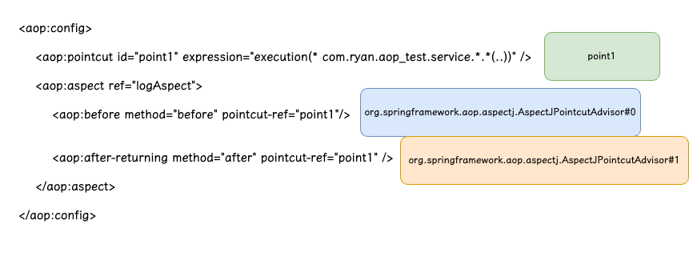

这部分我们来具体的看一下 Spring AOP 实现中，代理类究竟是什么时候被构建的。

# 案例准备
## maven pom 文件
- spring.version：5.3.22
- java.version：1.8
```xml
<!-- Spring核心库 -->  
<dependency>  
    <groupId>org.springframework</groupId>  
    <artifactId>spring-core</artifactId>  
    <version>${spring.version}</version>  
</dependency>

<!-- Spring IoC容器 -->  
<dependency>  
	    <groupId>org.springframework</groupId>  
    <artifactId>spring-beans</artifactId>  
    <version>${spring.version}</version>  
</dependency>  
  
<!-- Spring上下文支持，提供了BeanFactory的扩展 -->  
<dependency>  
    <groupId>org.springframework</groupId>  
    <artifactId>spring-context</artifactId>  
    <version>${spring.version}</version>  
</dependency>
```

## Service 接口与实现类
```java
public interface IUserService {  
  
    void queryUserName(String uId);  
  
    void queryUserId(String name);  
  
}

public class UserService implements IUserService {  
  
    @Override  
    public void queryUserName(String uId) {  
        System.out.println("查询用户名称为：ryan");  
    }  
  
    @Override  
    public void queryUserId(String name) {  
        System.out.println("查询用户ID为：10001");  
    }  
  
}
```

## 通知类
```java
public class LogAdvices {  
  
    public void before() {  
        System.out.println("before");  
    }  
  
    public void after() {  
        System.out.println("after");  
    }  
  
}
```
- 为了演示方便，本文所有的 Bean 都会通过配置文件来配置。

## Main 方法
```java
public class Main {  
  
    public static void main(String[] args) {  
        ClassPathXmlApplicationContext applicationContext = new ClassPathXmlApplicationContext("spring-aop.xml");  
        IUserService service = applicationContext.getBean("userService", IUserService.class);  
        System.out.println(service.getClass());  
        service.queryUserName("10001");  
    }  
  
}
```

## spring xml 配置文件
```java
<?xml version="1.0" encoding="UTF-8"?>  
<beans xmlns="http://www.springframework.org/schema/beans"  
       xmlns:xsi="http://www.w3.org/2001/XMLSchema-instance" xmlns:aop="http://www.springframework.org/schema/aop"  
       xsi:schemaLocation="http://www.springframework.org/schema/beans http://www.springframework.org/schema/beans/spring-beans.xsd http://www.springframework.org/schema/aop https://www.springframework.org/schema/aop/spring-aop.xsd">  
  
    <bean id="userService" class="com.ryan.aop_test.service.impl.UserService"/>  
    <bean id="logAspect" class="com.ryan.aop_test.LogAdvices" />  
  
    <aop:config>  
        <aop:pointcut id="point1" expression="execution(* com.ryan.aop_test.service.*.*(..))" />  
        <aop:aspect ref="logAspect">  
            <aop:before method="before" pointcut-ref="point1"/>  
            <aop:after-returning method="after" pointcut-ref="point1" />  
        </aop:aspect>  
    </aop:config>  
  
</beans>
```
关于 spring 通过 xml 配置 aop 的具体内容可以参照官网：

文档地址：[https://docs.spring.io/spring-framework/docs/5.2.25.RELEASE/spring-framework-reference/core.html#aop-schema](https://docs.spring.io/spring-framework/docs/5.2.25.RELEASE/spring-framework-reference/core.html#aop-schema)
需要注意，这种方式使用的是 Spring 的自动代理机制，如果有类似 `BeanNameAutoProxyCreator` 或类似的类使用了显示的代理，会导致其中的某一项失效。
建议的使用方式是仅使用`<aop:config>`样式或仅使用`AutoProxyCreator`样式，并且切勿混合使用它们。

## 执行结果
先来看一下上面的 Main 方法执行后的效果：
```
class com.sun.proxy.$Proxy3
before
查询用户名称为：ryan
after
```
可以看到，我们获取到的类是一个代理类，并且代理方法已经执行成功了。

# 源码分析
## XML 解析
当执行下面这条语句之后：
```java
ClassPathXmlApplicationContext applicationContext = new ClassPathXmlApplicationContext("spring-aop.xml");
```
会执行 `ClassPathXmlApplicationContext` 的 `refresh` 方法：
`org.springframework.context.support.AbstractApplicationContext#refresh()`
```java
@Override  
public void refresh() throws BeansException, IllegalStateException {  
    synchronized (this.startupShutdownMonitor) {  
       StartupStep contextRefresh = this.applicationStartup.start("spring.context.refresh");  
  
       // Prepare this context for refreshing.  
       prepareRefresh();  
  
       // Tell the subclass to refresh the internal bean factory.  
       ConfigurableListableBeanFactory beanFactory = obtainFreshBeanFactory();  
  
	   // ......
}
```
其中 `obtainFreshBeanFactory` 会执行 Bean 工厂的初始化，其中最重要的部分就是将 XML 配置文件中的 Bean 定义（Bean Definition）加载到 Bean 工厂中。

`org.springframework.context.support.AbstractApplicationContext#refresh()`
=> `org.springframework.context.support.AbstractRefreshableApplicationContext#refreshBeanFactory()`
=> `org.springframework.context.support.AbstractXmlApplicationContext#loadBeanDefinitions(DefaultListableBeanFactory beanFactory)`
上面的是从 `refresh()` 方法到具体加载 Bean Definition 方法的调用链路。

`org.springframework.context.support.AbstractXmlApplicationContext#loadBeanDefinitions(DefaultListableBeanFactory beanFactory)`
```java
@Override  
protected void loadBeanDefinitions(DefaultListableBeanFactory beanFactory) throws BeansException, IOException {  
    // Create a new XmlBeanDefinitionReader for the given BeanFactory.  
    XmlBeanDefinitionReader beanDefinitionReader = new XmlBeanDefinitionReader(beanFactory);  
  
    // Configure the bean definition reader with this context's  
    // resource loading environment.    beanDefinitionReader.setEnvironment(this.getEnvironment());  
    beanDefinitionReader.setResourceLoader(this);  
    beanDefinitionReader.setEntityResolver(new ResourceEntityResolver(this));  
  
    // Allow a subclass to provide custom initialization of the reader,  
    // then proceed with actually loading the bean definitions.    initBeanDefinitionReader(beanDefinitionReader);  
    loadBeanDefinitions(beanDefinitionReader);  
}
```
- 具体解析 XML 和加载 Bean Definition 的方法

关于具体是如何解析 XML 的，这里就不细看了，我们直接看一下从我们的 XML 配置文件中可以解析到什么
配置文件：[[🗺️【spring-aop】Spring 代理类创建流程梳理#spring xml 配置文件]]

```
beanDefinitionNames = {ArrayList@1626}  size = 6
 0 = "userService"
 1 = "logAspect"
 2 = "org.springframework.aop.config.internalAutoProxyCreator"
 3 = "point1"
 4 = "org.springframework.aop.aspectj.AspectJPointcutAdvisor#0"
 5 = "org.springframework.aop.aspectj.AspectJPointcutAdvisor#1"
```



除了这些 infrastructure，上面还有一个 **名称** 为`org.springframework.aop.config.internalAutoProxyCreator` 的 Bean。
这个 Bean 的**实际类型**是：`org.springframework.aop.framework.autoproxy.AbstractAdvisorAutoProxyCreator`，它是一个 `InstantiationAwareBeanPostProcessor`，`AbstractAdvisorAutoProxyCreator` 类实现了下面这个方法：
```java
default Object postProcessBeforeInstantiation(Class<?> beanClass, String beanName) throws BeansException {  
    return null;  
}
```
这个方法会在 Bean 的实例化前被调用，可以用于修改和创建 Bean 对象。
除此之外，`AbstractAdvisorAutoProxyCreator` 还实现了 `BeanPostProcessor` 接口的 `postProcessAfterInitialization`，在 Bean 对象执行完初始化方法后，会调用这个方法检测是否需要将其转化为代理对象。
`AbstractAdvisorAutoProxyCreator` 是 AOP 代理中非常关键的一个类，整个创建 AOP 代理的核心流程就是其执行的这两个方法。

## 加载 Creator
上面提到，`org.springframework.aop.config.internalAutoProxyCreator` 是一个 `BeanPostProcessor`，那它具体创建并注册的位置就是：
`org.springframework.context.support#registerBeanPostProcessors(ConfigurableListableBeanFactory beanFactory)`
调用这个方法的位置还是 `ApplicationContext` 的 `refresh()` 方法，具体的调用链路为：
`org.springframework.context.support.AbstractApplicationContext#refresh()`
=> `org.springframework.context.support.AbstractApplicationContext#registerBeanPostProcessors(ConfigurableListableBeanFactory beanFactory)`
=> `org.springframework.context.support.PostProcessorRegistrationDelegate#registerBeanPostProcessors(ConfigurableListableBeanFactory beanFactory, AbstractApplicationContext applicationContext)`

具体就是将 `BeanPostProcessor` 加载到工厂中，方便后续的调用。
具体存放 `BeanPostProcessor` 的位置为：`org.springframework.beans.factory.support.AbstractBeanFactory` 的 `beanPostProcessors` 属性。

## 加载 Advisors
- 在「**XML 解析**」部分，我们看到了 spring 为我们将 xml 中定义的 `<acp:config />` 解析为具体的 Bean 定义。
- 并且在「**加载 Creator**」部分，spring 已经将 AOP 创建者类注册成了一个 `InstantiationAwareBeanPostProcessor`。
在将单例 Bean（原型 Bean 也可以被代理，本文只关注单例 Bean 的代理过程）加载代理之前，肯定是要将上面 `<acp:config />` 中配置的 Bean 构建出来的。
而如果按照我们在 xml 中配置的方式，显然先构建的 Bean 将会是 `userService`。
所以在所有的 Bean 实例化之前，需要确保这些构建 AOP 的 infrastructure 被提前构建好，这就是 `AbstractAdvisorAutoProxyCreator` 在 Bean 初始化之前执行的逻辑。

我们依然从 `refresh()` 方法开始：
`org.springframework.context.support.AbstractApplicationContext#refresh()`

=>`org.springframework.context.support.AbstractApplicationContext#finishBeanFactoryInitialization(ConfigurableListableBeanFactory beanFactory)`

=> `org.springframework.beans.factory.support.DefaultListableBeanFactory#preInstantiateSingletons()`

在预先实例化单例 Bean 的方法中，会对所有的 Bean 执行 `getBean()` 方法，`getBean()` 方法如果发现 Bean 没有被加载或者为原型 Bean，将会触发 Bean 的加载。

=> `org.springframework.beans.factory.support.AbstractBeanFactory.getBean(String name)`

=> `org.springframework.beans.factory.support.AbstractBeanFactory.doGetBean(String name, @Nullable Class<T> requiredType, @Nullable Object[] args, boolean typeCheckOnly)`

=> `org.springframework.beans.factory.support.AbstractAutowireCapableBeanFactory#createBean(String beanName, RootBeanDefinition mbd, @Nullable Object[] args)`

Bean 的 `createBean()` 方法实际上是延迟调用的，后续在 spring 三级缓存中会具体讲解，这里我们可以视为直接调用了 `createBean()` 方法

=> `org.springframework.beans.factory.support.AbstractAutowireCapableBeanFactory#resolveBeforeInstantiation(String beanName, RootBeanDefinition mbd)`

=> `org.springframework.beans.factory.support.AbstractAutowireCapableBeanFactory#applyBeanPostProcessorsBeforeInstantiation(Class<?> beanClass, String beanName)`

这里就是具体执行 `BeanPostProcessor` 的位置：
```java
protected Object applyBeanPostProcessorsBeforeInstantiation(Class<?> beanClass, String beanName) {  
    for (InstantiationAwareBeanPostProcessor bp : getBeanPostProcessorCache().instantiationAware) {  
       Object result = bp.postProcessBeforeInstantiation(beanClass, beanName);  
       if (result != null) {  
          return result;  
       }  
    }  
    return null;  
}
```
在这里会遍历所有的 `BeanPostProcessor`，然后调用其 `postProcessBeforeInstantiation`，上面的 `AbstractAdvisorAutoProxyCreator` 的该方法就是在这里调用的。

`org.springframework.aop.framework.autoproxy.AbstractAutoProxyCreator#postProcessBeforeInstantiation(Class<?> beanClass, String beanName)`
```java
@Override  
public Object postProcessBeforeInstantiation(Class<?> beanClass, String beanName) {  
    Object cacheKey = getCacheKey(beanClass, beanName);  
  
    if (!StringUtils.hasLength(beanName) || !this.targetSourcedBeans.contains(beanName)) {  
       if (this.advisedBeans.containsKey(cacheKey)) {  
          return null;  
       }  
       if (isInfrastructureClass(beanClass) || shouldSkip(beanClass, beanName)) {  
          this.advisedBeans.put(cacheKey, Boolean.FALSE);  
          return null;  
       }  
    }  
  
	// 如果有自定义的 TargetSource，则在这里创建代理对象
    TargetSource targetSource = getCustomTargetSource(beanClass, beanName);  
    if (targetSource != null) {  
       if (StringUtils.hasLength(beanName)) {  
          this.targetSourcedBeans.add(beanName);  
       }  
       Object[] specificInterceptors = getAdvicesAndAdvisorsForBean(beanClass, beanName, targetSource);  
       Object proxy = createProxy(beanClass, beanName, specificInterceptors, targetSource);  
       this.proxyTypes.put(cacheKey, proxy.getClass());  
       return proxy;  
    }  
  
    return null;  
}
```
在上面的 `shouldSkip()` 方法中，会尝试去获取所有的 Advisor，未创建的话，则会去尝试创建这些 `Advisor`。
`org.springframework.aop.framework.autoproxy.AbstractAutoProxyCreator#shouldSkip(Class<?> beanClass, String beanName)`
=> `org.springframework.aop.framework.autoproxy.AspectJAwareAdvisorAutoProxyCreator#findCandidateAdvisors()`
=> `org.springframework.aop.framework.autoproxy.BeanFactoryAdvisorRetrievalHelper#findAdvisorBeans()`
```java
	public List<Advisor> findAdvisorBeans() {
		// 获取 advisorNames
		String[] advisorNames = this.cachedAdvisorBeanNames;
		if (advisorNames == null) {
			// Do not initialize FactoryBeans here: We need to leave all regular beans
			// uninitialized to let the auto-proxy creator apply to them!
			advisorNames = BeanFactoryUtils.beanNamesForTypeIncludingAncestors(
					this.beanFactory, Advisor.class, true, false);
			this.cachedAdvisorBeanNames = advisorNames;
		}
		if (advisorNames.length == 0) {
			return new ArrayList<>();
		}
		// 不断从 Factory 中去 getBean()
		List<Advisor> advisors = new ArrayList<>();
		for (String name : advisorNames) {
			if (isEligibleBean(name)) {
				if (this.beanFactory.isCurrentlyInCreation(name)) {
					if (logger.isTraceEnabled()) {
						logger.trace("Skipping currently created advisor '" + name + "'");
					}
				}
				else {
					try {
						advisors.add(this.beanFactory.getBean(name, Advisor.class));
					}
					catch (BeanCreationException ex) {
						// ......
					}
				}
			}
		}
		return advisors;
	}
```
最终在 `BeanFactoryAdvisorRetrievalHelper` 中，获取到了所有的 `advisor`。
对于没有指定 `targetSource` 的 Bean，`AbstractAdvisorAutoProxyCreator` 不会对其进行任何操作，而是只进行了 Advisor 的初始化。
## 创建代理类
从 `createBean()` 方法开始，我们再来看一下代理类具体是怎么创建的：
`org.springframework.beans.factory.support.AbstractAutowireCapableBeanFactory#createBean(String beanName, RootBeanDefinition mbd, @Nullable Object[] args)`

=> `org.springframework.beans.factory.support.AbstractAutowireCapableBeanFactory#doCreateBean(String beanName, RootBeanDefinition mbd, @Nullable Object[] args)`

`doCreateBean` 就是实际上创建 Bean 的方法，当 Bean 被实例化完成之后，会执行 Bean 的初始化，当其初始化结束之后，就会执行 `AbstractAdvisorAutoProxyCreator` 实现的另一个重要方法，代理类的构建就是在这里完成的。

=> `org.springframework.beans.factory.support.AbstractAutowireCapableBeanFactory#initializeBean(String beanName, Object bean, @Nullable RootBeanDefinition mbd)`

=> `org.springframework.beans.factory.support.AbstractAutowireCapableBeanFactory#applyBeanPostProcessorsAfterInitialization(wrappedBean, beanName)`

这个方法会执行所有的 `BeanPostProcessor` 的 `postProcessAfterInitialization()` 方法，`AbstractAdvisorAutoProxyCreator` 中的这个方法就是在这里执行的：
```java
@Override  
public Object postProcessAfterInitialization(@Nullable Object bean, String beanName) {  
    if (bean != null) {  
       Object cacheKey = getCacheKey(bean.getClass(), beanName);  
       if (this.earlyProxyReferences.remove(cacheKey) != bean) {  
          return wrapIfNecessary(bean, beanName, cacheKey);  
       }  
    }  
    return bean;  
}
```


