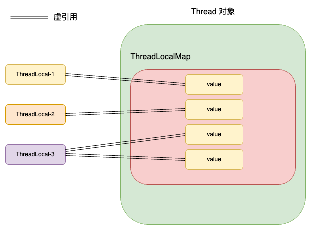
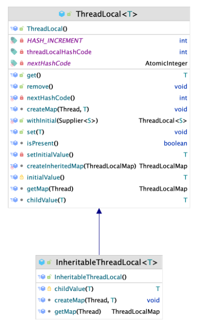

`ThreadLocal` ，从字面含义上来看就是："线程本地"，这形象的说明了它的用处： `ThreadLocal` 正是 Java 提供的一种线程本地存储机制，可以利用该就只将数据还存在某个线程的内部，该线程可以在任意的时刻、任意的方法中去获取缓存的数据。            
# 基本介绍            
`ThreadLocal` 共有两种类型， `ThreadLocal` 本身和他的子类 `InheritableThreadLocal`。            
**普通类型的 `ThreadLocal`**： 这种 `ThreadLocal` 可以存储任意类型的数据，例如：            
```java            
ThreadLocal<String> threadLocalString = new ThreadLocal<>();            
ThreadLocal<Integer> threadLocalInteger = new ThreadLocal<>();            
```            
普通类型的 `ThreadLocal` 可以用于在每个线程中存储不同类型的数据，并且每个线程访问该`ThreadLocal` 对象时，都可以获取到其线程私有的变量副本。            
`InheritableThreadLocal` 类型的 `ThreadLocal`： `InheritableThreadLocal` 是 `ThreadLocal` 的一个子类；它允许子线程访问父线程设置的本地变量。            
具体原理是：当子线程创建时，它会继承父线程中 `InheritableThreadLocal` 的值。例如：            
```java            
InheritableThreadLocal<String> inheritableThreadLocal = new InheritableThreadLocal<>();            
```            
通过下面的图可以很清晰的看出线程和 `ThreadLocal`  的对应关系            
            
()            
            
# ThreadLocal 篇            
## 基本介绍            
`ThreadLocal` 底层是通过 `ThreadLocalMap` 实现的，每个 `Thread` 对象中都有一个名为 `ThreadLocalMap` 的属性：            
```java            
	/*            
	ThreadLocal values pertaining to this thread. This map is maintained            
	 * by the ThreadLocal class.            
	 */            
	ThreadLocal.ThreadLocalMap threadLocals = null;            
```            
`ThreadLocalMap` 是 `ThreadLocal` 的静态内部类，存储的 KEY 为 `ThreadLocal` 对象，`VALUE` 就是实际的数据。            
## ThreadLocal 的 set 方法            
下面我们通过 debug 下面这段代码，来看看 `ThreadLocal` 的执行逻辑：            
```java            
public static void main(String[] args) {            
    threadLocal.set("Hello World!");            
    System.out.println(threadLocal.get());            
}            
```            
首先调用的是 `void ThreadLocal.set(T value)`            
```java            
public void set(T value) {            
    Thread t = Thread.currentThread();            
    ThreadLocalMap map = getMap(t);            
    if (map != null) {            
        map.set(this, value);            
    } else {            
        createMap(t, value);            
    }            
}            
            
ThreadLocalMap getMap(Thread t) {            
    return t.threadLocals;            
}            
```            
获取到当前执行该方法的线程，通过调用 `getMap(Thread t)` 方法来获取线程的 `threadLocals` 属性。            
线程对象的 `threadLocals` 属性初始为 `null`，它正式的创建时机就是第一次调用 `ThreadLocal` 的 `set()` 方法的时候，所以可以看到上面还有一个 `createMap` 方法;            
如果是第二次添加，此时的 `map` 不为空，就直接通过调用 `map` 的 `set` 方法来添加一个新的键值对。            
这里要特别关注键值对的内容：键是 `this` 也就是 `ThreadLocal` 对象本身，而值就是上面传入的 `value`，从这里可以看出，`ThreadLocal` 是作为键值对的键存在的，真实的数据其实就是存储在线程对象 `Thread` 中的。            
            
---            
## 真正负责存储的数据结构-ThreadLocalMap            
### Entry 对象            
既然谈到了 `ThreadLocalMap` 类，这里来详细的看看它是如何实现键值对的对应关系的；以及在 Entry 如何通过虚引用（WeakReference）来解决内存泄露的问题的？            
`ThreadLocalMap` 是 `ThreadLocal` 的一个静态内部类，数据被封装成一个 `Entry` 类，然后存储在 `ThreadLocalMap` 的 `table` 属性中：            
```java            
	/**            
	 * The table, resized as necessary.            
	 * table.length MUST always be a power of two.            
	 */            
	private Entry[] table;            
```            
`Entry` 是 `ThreadLocalMap` 的一个内部类，它的代码非常简单：            
```java            
        static class Entry extends WeakReference<ThreadLocal<?>> {            
            /** The value associated with this ThreadLocal. */            
            Object value;            
            
            Entry(ThreadLocal<?> k, Object v) {            
                super(k);            
                value = v;            
            }            
        }            
```            
我们将它和 `HashMap` 中对数据的封装类 `Node` 做一下比较：            
```java            
static class Node<K,V> implements Map.Entry<K,V> {              
    final int hash;              
    final K key;              
    V value;              
    Node<K,V> next;            
    // 其他方法......            
}            
```            
区别在于对 KEY 对处理，`Entry` 并没有直接保存对 KEY 的引用，而是通过继承 `WeakReference` 实现了对 KEY 的虚引用。            
而当对象 **仅** 被虚引用所指向的时候，JVM 进行 GC 垃圾回收的时候，**会直接将其回收**， 也就是当 `ThreadLocal` 对象仅仅被 `ThreadLocalMap` 中的 `Entry` 引用的时候，`ThreadLocal` 对象仍然会被回收。            
但是 `Thread` 对象中的 `Node` 是不会随着 `ThreadLocal` 的回收而自动回收的，因为 `table` 数组对 `Entry` 对象的引用属于强引用，这就引发了内存泄露的问题，也就是使用的内存并没有被及时的回收。            
### 清除无效 Entry 对象`            
如果这样看的话，理论上只要线程对象不被销毁，那 `Entry` 对象就永远不会被回收，这设计显然是不太合理的，所以 `ThreadLocalMap` 中还存在这样一些自动回收方法，其中比较常用的是 `cleanSomeSlots`：            
```java            
private boolean cleanSomeSlots(int i, int n) {              
    boolean removed = false;              
    Entry[] tab = table;              
    int len = tab.length;              
    do {              
        i = nextIndex(i, len);              
        Entry e = tab[i];              
        // 检测 Entry 是否引用了 null            
        if (e != null && e.refersTo(null)) {              
            n = len;              
            removed = true;              
            i = expungeStaleEntry(i);              
        }              
    } while ( (n >>>= 1) != 0);  // 对数级别的时间复杂度            
    return removed;              
}            
```            
以大约 `O(logn)` 的时间复杂度去检测数组中元素是否存在空引用（也就是检测 `ThreadLocal` 是否被回收），如果出现了空引用，就调用 `expungeStaleEntry(i)` 方法；            
这个方法的效果是将索引位置的条目设置为 null，并减少哈希表的大小；并且，从索引位置开始，遍历到下一个 null 条目之前的所有条目，清除其他失效条目，并 **重新计算** 有效条目的哈希值，将其放置在正确的位置。            
上面提到，重新计算的原因是，`ThreadLocalMap` 解决哈希冲突的方法是链地址法，如果后面的元素很可能原本的索引位置是前面删除的元素，这样可以再每次删除元素的时候规整数组。            
这个方法的执行时机有这么两个：            
- `set(ThreadLocal<?> key, Object value)`：调用 set 添加 K-V 键值对的时候            
- `replaceStaleEntry(ThreadLocal<?> key, Object value,  int staleSlot)`：当插入元素的时候，如果发现该位置 `Entry` 对象的引用为 null，表示这个 `Entry` 已经失效，此时会调用这个方法来进行替换操作，此时需要再检测一下是否有其他 `Entry` 过期。            
但这些自动回收方式都是相对被动的，最最根本的方式还是要在不使用 `ThreadLocal` 之前调用它的 `remove()` 方法：            
java.lang.ThreadLocal#remove()            
```java            
public void remove() {              
    ThreadLocalMap m = getMap(Thread.currentThread());              
    if (m != null) {              
        m.remove(this);              
    }              
}            
```            
### 哈希函数与链地址法            
`ThreadLocalMap` 计算索引的方式为：            
```java            
int i = key.threadLocalHashCode & (len-1);            
```            
直接将 `ThreadLocal` 对象的 `HashCode` 与 数组的长度减一 做一个按位与的操作，将其映射到数组中的一个位置。            
在 `ThreadLocalMap` 中，采用了**线性探测的方式**来解决哈希冲突，当出现了哈西冲突的时候，具体体现在 `nextIndex` 方法中：            
```java            
private static int nextIndex(int i, int len) {            
    return ((i + 1 < len) ? i + 1 : 0);            
}            
```            
在原位置的基础上不断加一来寻找下一个存放，当越界的时候就再从 0 开始寻找。            
### 数据的存取            
```java            
private Entry getEntry(ThreadLocal<?> key) {              
    int i = key.threadLocalHashCode & (table.length - 1);              
    Entry e = table[i];              
    if (e != null && e.get() == key)              
        return e;              
    else              
        return getEntryAfterMiss(key, i, e);              
}            
```            
上面的是 `ThreadLocalMap` 的 `get` 方法，其通过哈希函数获取到坐标后，从 `table` 中获取并返回 `Entry`。            
因为 `ThreadLocalMap` 采用的是链地址法，只探测一个位置没有数据显然是不够的，`getEntryAfterMiss` 方法会一直检索到下一个空位置，如果还没有找到对应的元素才会返回 `null`。            
            
```java            
        private void set(ThreadLocal<?> key, Object value) {            
            Entry[] tab = table;            
            int len = tab.length;            
            int i = key.threadLocalHashCode & (len-1);            
            
            for (Entry e = tab[i];            
                 e != null;            
                 e = tab[i = nextIndex(i, len)]) {            
                ThreadLocal<?> k = e.get();            
            
                if (k == key) {            
                    e.value = value;            
                    return;            
                }            
            
                if (k == null) {            
                    replaceStaleEntry(key, value, i);            
                    return;            
                }            
            }            
            
            tab[i] = new Entry(key, value);            
            int sz = ++size;            
            if (!cleanSomeSlots(i, sz) && sz >= threshold)            
                rehash();            
        }            
```            
`set` 方法中，不断通过 `nextIndex` 获取下一个位置，如果发现没有元素的位置就将其插入，如果发现有元素的位置，就执行替换的操作。            
            
---            
## ThreadLocal 的 get 方法            
get 方法是以当前的 `ThreadLocal` 对象作为 KEY，从 Thread 对象的 `ThreadLocalMap` 中去取得对应的 VALUE 值：            
```java            
public T get() {            
    Thread t = Thread.currentThread();            
    ThreadLocalMap map = getMap(t);            
    if (map != null) {            
        ThreadLocalMap.Entry e = map.getEntry(this);            
        if (e != null) {            
            @SuppressWarnings("unchecked")            
            T result = (T)e.value;            
            return result;            
        }            
    }            
    return setInitialValue();            
}            
```            
通过 `getMap()` 方法获取线程对象的 `ThreadLocalMap` ，然后通过 `getEntry()` 方法从 map 中获取对应的数据，也就是通过 `ThreadLocal` 的哈希值，去映射到`ThreadLocalMap` 的 Entry 数组的一个下标，来将对应的对象取出。            
## InheritableThreadLocal 篇            
继承关系：            
            
### InheritableThreadLocal 是如何实现继承的？            
`InheritableThreadLocal` 继承了父类 `ThreadLocal` 并且重写了它的 `getMap()` 和 `createMap()` 等方法            
```java            
    ThreadLocalMap getMap(Thread t) {            
       return t.inheritableThreadLocals;            
    }            
            
    void createMap(Thread t, T firstValue) {            
        t.inheritableThreadLocals = new ThreadLocalMap(this, firstValue);            
    }            
```            
当创建和获取的时候，都使用的是 `ThreadLocal` 中的 `inheritableThreadLocals` 属性，关于继承和使用的逻辑，也都是围绕这个属性去实现的，我们跟着下面的调试代码来具体的看一下：            
```java            
public class Main {            
    static InheritableThreadLocal<String> threadLocal = new InheritableThreadLocal<>();            
    public static void main(String[] args) {            
        Thread parentThread = new Thread(() -> {            
            threadLocal.set("Hello World");            
            Thread sonThread = new Thread(() -> {            
                System.out.println(threadLocal.get());            
            });            
            sonThread.start();            
        });            
        threadLocal.remove();            
        parentThread.start();            
    }            
}            
```            
当调用父线程调用 `threadLocal.set()` 方法的时候，调用的还是 `ThreadLocal` 中的 `set()` 方法：            
```java            
    public void set(T value) {            
        Thread t = Thread.currentThread();            
        ThreadLocalMap map = getMap(t);            
        if (map != null) {            
            map.set(this, value);            
        } else {            
            createMap(t, value);            
        }            
    }            
```            
只是此时通过 `getMap()` 获取到的不再是线程对象的 `threadLocals` 而是 `inheritableThreadLocals` 属性。            
通过上面的内容，我们知道了在线程对象中，`InheritableThreadLocal` 的值和 `ThreadLocal` 是**存储在不同属性中**的；            
当子线程创建的时候，就会去检测父线程中的`InheritableThreadLocal` 属性中是否存在值，如果存在会将其复制一份，并且保存在自己对应的属性中：            
下面展示的就是创建线程的方法：            
```java            
    private void init(ThreadGroup g, Runnable target, String name,            
                      long stackSize, AccessControlContext acc,            
                      boolean inheritThreadLocals) {            
        // ......            
        Thread parent = currentThread();            
        if (inheritThreadLocals && parent.inheritableThreadLocals != null)            
            this.inheritableThreadLocals =            
                ThreadLocal.createInhritedMap(parent.inheritableThreadLocals);            
				            
			  // 。。。。。。            
    }            
    static ThreadLocalMap createInheritedMap(ThreadLocalMap parentMap) {            
        return new ThreadLocalMap(parentMap);            
    }            
```            
线程初始化的时候，如果发现父线程中的 `inheritableThreadLocals` 存在值，就会调用 `ThreadLocal` 中的 `createInhritedMap` 方法；这个方法是静态内部类 `ThreadLocalMap` 的 `private` 构造方法，它负责将参数中的 `ThreadLocalMap` 复制一份到当前创建的对象之中：            
```java            
        private ThreadLocalMap(ThreadLocalMap parentMap) {            
            Entry[] parentTable = parentMap.table;            
            int len = parentTable.length;            
            setThreshold(len);            
            table = new Entry[len];            
            
            for (int j = 0; j < len; j++) {            
                Entry e = parentTable[j];            
                if (e != null) {            
                    @SuppressWarnings("unchecked")            
                    ThreadLocal<Object> key = (ThreadLocal<Object>) e.get();            
                    if (key != null) {            
                        Object value = key.childValue(e.value);            
                        // 是复制一份，而不是直接存储            
                        Entry c = new Entry(key, value);            
                        int h = key.threadLocalHashCode & (len - 1);            
                        while (table[h] != null)            
                            h = nextIndex(h, len);            
                        table[h] = c;            
                        size++;            
                    }            
                }            
            }            
        }            
                    
		// 控制子线程的继承内容              
		protected T childValue(T parentValue) {            
			return parentValue;            
		}            
```            
通过上面的 `Entry c = new Entry(key, value);` 就可以看出，是将 `Entry` 直接复制了一份，而不是单纯的指向。            
这样，子线程就继承了父亲线程的的 `InheritableThreadLocal` 中存储的内容。            