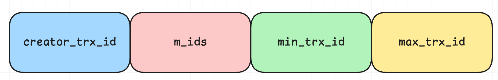
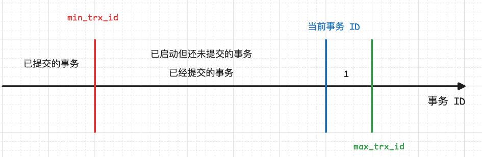
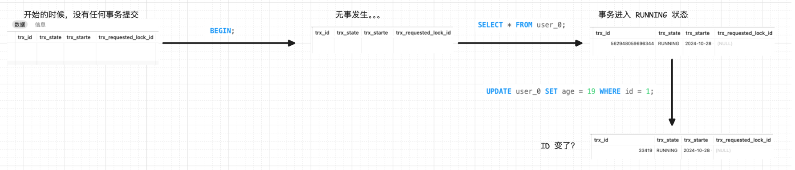
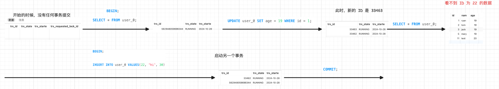
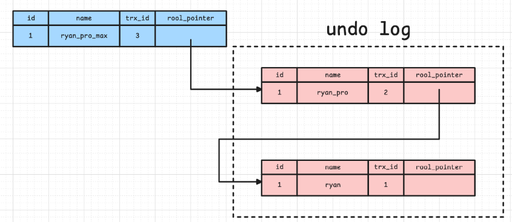

# 关于 Read View
Read View 主要用于在事务执行期间确定哪些版本的数据对当前事务可见。在多版本并发控制中，数据库会为每个事务创建一个 Read View，通过这个 Read View，事务可以看到在其开始时已经提交的数据版本，而不会看到在其执行过程中其他事务未提交的数据或者已提交但对当前事务不可见的数据。
## Read View 的创建
下面是 MySQL 8.0.26 中创建 Read View 的代码，这是对普通的SELECT的处理，在查询开启前需要生成ReadView。
```cpp
/* Do some start-of-statement preparations */  
if (!prebuilt->sql_stat_start) {  
  /* No need to set an intention lock or assign a read view */  
  if (!MVCC::is_view_active(trx->read_view) && !srv_read_only_mode &&  
      prebuilt->select_lock_type == LOCK_NONE) {  
    ib::error(ER_IB_MSG_1031) << "MySQL is trying to perform a"  
                                 " consistent read but the read view is not"                                
                                  " assigned!"; 
    trx_print(stderr, trx, 600);  
    fputc('\n', stderr);  
    ut_error;  
  }  
} else if (prebuilt->select_lock_type == LOCK_NONE) {  
  /* This is a consistent read */  
  /* Assign a read view for the query */  
  if (!srv_read_only_mode) {  
    trx_assign_read_view(trx);  
  }  
  prebuilt->sql_stat_start = FALSE;  
} else {  
wait_table_again:  
  err = lock_table(0, index->table,  
                   prebuilt->select_lock_type == LOCK_S ? LOCK_IS : LOCK_IX,  
                   thr);  
  
  if (err != DB_SUCCESS) {  
    table_lock_waited = TRUE;  
    goto lock_table_wait;  
  }  
  prebuilt->sql_stat_start = FALSE;  
}
```
上面给出的代码是 MySQL 在执行一条 `SELECT` 语句的时候准备阶段做的事情，对于普通的 `SELECT` 语句（不加锁读），会在开始的时候生成一个 Read View：
```cpp
else if (prebuilt->select_lock_type == LOCK_NONE) {  
  /* This is a consistent read */  
  /* Assign a read view for the query */  
  if (!srv_read_only_mode) {  
    trx_assign_read_view(trx);  
  }  
  prebuilt->sql_stat_start = FALSE;  
}
```
而对于加锁读的语句：
```cpp
 else {  
wait_table_again:  
  err = lock_table(0, index->table,  
                   prebuilt->select_lock_type == LOCK_S ? LOCK_IS : LOCK_IX,  
                   thr);  
  
  if (err != DB_SUCCESS) {  
    table_lock_waited = TRUE;  
    goto lock_table_wait;  
  }  
  prebuilt->sql_stat_start = FALSE;  
}
```
则不会生成 Read View，而是先在尝试在表格上加一个意向锁（S 锁 或者 X 锁）。
## Read View 的构成


Read View 有四个重要的字段：
- `m_ids` ：指的是在创建 Read View 时，当前数据库中「活跃事务」的**事务 id 列表**，注意是一个列表，**“活跃事务”指的就是，启动了但还没提交的事务**。
- `min_trx_id` ：指的是在创建 Read View 时，当前数据库中「活跃事务」中事务 **id 最小的事务**，也就是 m_ids 的最小值。
- `max_trx_id` ：这个并不是 m_ids 的最大值，而是**创建 Read View 时当前数据库中应该给下一个事务的 id 值**，也就是全局事务中最大的事务 id 值 + 1；
- `creator_trx_id` ：指的是**创建该 Read View 的事务的事务 id**。
具体可以看 `class ReadView` 的 `private` 域中的属性，其中经常提及的 trx 就是事务 transaction 的缩写：
```cpp
private:  
 /** The read should not see any transaction with trx id >= this  
 value. In other words, 
 this is the "high water mark". */ 
 trx_id_t m_low_limit_id;  
  
 /** The read should see all trx ids which are strictly  
 smaller (<) than this value.  
 In other words, this is the low water mark". */ 
 trx_id_t m_up_limit_id;  
  
 /** trx id of creating transaction, 
 set to TRX_ID_MAX for free views. */ 
 trx_id_t m_creator_trx_id;  
  
 /** Set of RW transactions that 
 was active when this snapshot  
 was taken */ 
 ids_t m_ids;  
  
 /** The view does not need to see the undo logs for transactions  
 whose transaction number is strictly smaller (<) than this value: 
 they can be removed in purge if not needed by other views */ 
 trx_id_t m_low_limit_no;
```
除了上面提到的四个变量，还有一个 `m_low_limit_no`，这个变量是当前事务读取的 `undo-log` 的最小值，用于确定视图不需要看到哪些事务的回滚日志。如果一个事务的事务号严格小于这个值，并且如果没有其他视图需要这些回滚日志，那么这些回滚日志可以在清理（purge）操作中被移除。
上面提到的四个重要字段圈定了这么一个范围：



当一个事务执行的过程中，它应该只能看到在其启动已经完成的事务，那就来看看哪些事务可以满足这个情况：
1. 如果一个事务的 ID 小于 `min_trx_id`，也就是当前活跃事务的最小 ID 之前都事务，一定是已经提交了的。
2. 如果事务 ID 在 `min_trx_id` 和 `max_trx_id` 之间，则会存在已经提交和未提交的事务，此时就需要借助 `m_ids`（启动事务的时候活跃的事务，是一个 Set 类型），去检查这里面是否含有这个事务，如果不含有，则说明这个事务也是在事务之前提交的。

>[!question] 在这里提一个疑问了，第一条可以理解，第二条的话，会不会有这样的情况：有个事务未启动且未提交，而它的 ID 处于 `min_trx_id` 到 `max_trx_id` 这个范围内，在我们的事务执行的时候，这个事务猛然执行然后提交了，我们的事务可以看见这个事务的提交情况吗？
>这个我们大可放心，因为当事务未启动的时候根本也不会分配 ID，且事务 ID 的分配是 Innodb 通过 max_trx_id 来控制的，不会出现这种情况，下面这一大段内容中我做了两个有意思的事务实验，可以帮助大家更好的理解事务 ID 是如何分配的。
- 第一种：begin/start transaction 命令；
- 第二种：start transaction with consistent snapshot 命令；
这里就需要稍微提一下启动事务的机制了，上面展示出来的是两种事务的启动方法，对于第一种方法，并不是事务真正的启动了，我们来简单看下面的案例，在这个案例中我们会不断通过这个语句来观察事务的情况：
```sql
SELECT * FROM INFORMATION_SCHEMA.INNODB_TRX;
```


1. 开始的时候，事务表中没有任何事务。
2. 然后我们执行 `BEGIN` 语句，可以观察到还是没有任何的数据产生。
3. 而此时执行第一条查询语句的时候，事务才真正的显露出来，此时有了事务 ID。
但是当我们执行修改语句的时候，事情变得离奇起来，事务的 ID 居然变了，这是因为在 MySQL 中（当前使用的是版本 8.0.26），只读的事务分配的是一个虚拟的 trx_id，其值一定是大大超过当前执行修改数据的事务的，只有当事务真正的要修改数据库的时候，才会产生实际的事务 ID。
trx_id 是由 InnoDB 内部维护的，InnoDB 内部维护了一个 max_trx_id 全局变量，每次需要申请一个新的 trx_id 时，就获得 max_trx_id 的当前值，然后并将 max_trx_id 加 1，这也是为什么我们连续启动两个修改数据的事务的时候，事务 ID 会是相邻的两个 ID。
但是即使分配的是虚拟的事务 ID，Read View 也是在执行 SELECT 语句后立刻创建的，所以延迟分配 ID 并不会影响 MVCC 的效果 ，来看这样一个案例：


上面的案例中，我们启动运行了两个事务，第一个事务执行 SELECT 语句生成 Read View，第二个事务启动并添加新的记录，此时第一个事务再执行 UPDATE 语句（不要 UPDATE 第二个事务新添加的数据，否则会就会出现幻读）；此时可以看到第一个事务的 ID 是大于第二个事务的，第二个事务提交之后第一个事务也是看不到其添加的数据的。
上面的案例也佐证了 Read View 生成的时机是执行普通 SELECT 语句的时候，可能早于真实事务 ID 的分配。
## Read View 可见性判断
通过上面的 Read View，我们可以圈定一个范围，哪个是当前执行的事务该看到的，哪个是当前事务不该看到的。
这里可以看一下具体的代码，会更容易理解一些：
```cpp
/** Check whether the changes by id are visible.  
@param[in]  id transaction id to check against the view  
@param[in]  name table name  
@return whether the view sees the modifications of id. */  
[[nodiscard]] bool changes_visible(trx_id_t id,   const table_name_t &name) const {  
// 检查 ID 是否大于零，如果否会直接返回异常
  ut_ad(id > 0);  

// 如果 ID 小于等于 min_trx_id ，直接返回 true
  if (id < m_up_limit_id || id == m_creator_trx_id) {  
    return (true);  
  }  

// 检查 ID 的准确定
  check_trx_id_sanity(id, name);  

// 如果 ID 大于等于 max_trx_id 直接返回 false
  if (id >= m_low_limit_id) {  
    return (false);  
  } else if (m_ids.empty()) {
  // 如果 ID 在 min_trx_id 到 max_trx_id 之间
    return (true);  
  }  
// 在 m_jds 中搜索 ID，如果不存在，返回 true
  const ids_t::value_type *p = m_ids.data();  
  
  return (!std::binary_search(p, p + m_ids.size(), id));  
}
```
# MySQL 中的隐藏列
上面的 Read View 帮助我们解决了当前事务该看到什么记录。
但是不同的事务所看到的记录是不相同的，需要有一个位置能够将这些不同事务看到的不同记录存储下来，这就是 MySQL 中的隐藏列要解决的问题。


它里面包含两个隐藏列：
- trx_id，当一个事务对某条聚簇索引记录进行改动时，就会**把该事务的事务 id 记录在 trx_id 隐藏列里**；
- roll_pointer，每次对某条聚簇索引记录进行改动时，都会把旧版本的记录写入到 undo 日志中，然后**这个隐藏列是个指针，指向每一个旧版本记录**，于是就可以通过它找到修改前的记录。
# 实际应用
通过上面的 Read View 和 MySQL 中的隐藏列，我们已经解决了这两大关键的问题
- 当前事务应该看到哪些数据
- 不同事务看到的不同数据应该如何存储
接下来实现具体的隔离状态就好理解一些了。

**实现可重复读的方式**：
可重复读的要求是只能看到当前事务启动的时候的数据，那 Read View 就应该在事务一启动的时候生成。
在搜索的过程中不断的去通过当前持有的 Read View 中的 `change_visible` 方法去检查自己能否看到这一列，不能的话，就通过隐藏列的 undo log 来找到在本事务开启之前，这一条数据的状态。

**实现读已提交的方式**：
读已提交的实现方式就是在每次执行语句的时候都会创建一个 Read View，创建 Read View 的语句是这样的：
```cpp
ReadView *trx_assign_read_view(trx_t *trx) /*!< in/out: active transaction */  
{  
  ut_ad(trx_can_be_handled_by_current_thread_or_is_hp_victim(trx));  
  ut_ad(trx->state.load(std::memory_order_relaxed) == TRX_STATE_ACTIVE);  
  
  if (srv_read_only_mode) {  
    ut_ad(trx->read_view == nullptr);  
    return (nullptr);  
  } else if (!MVCC::is_view_active(trx->read_view)) {  
    trx_sys->mvcc->view_open(trx->read_view, trx);  
  }  
  
  return (trx->read_view);  
}

static bool is_view_active(ReadView *view) {  
  ut_a(view != reinterpret_cast<ReadView *>(0x1));  
  return (view != nullptr && !(intptr_t(view) & 0x1));  
}
```
当 `!MVCC::is_view_active(trx->read_view)` 的时候，这个方法会创建一个新的 Read View，而这个方法中的一个要求就是当前事务的 view 是 nullptr，所以我们只需要在每次执行完语句之后，删除这个事务的 Read View 就可以实现每次执行语句的时候都分配新的 Read View 了。
而 MySQL 确实是这样做的：
```cpp
else if (trx->isolation_level <= TRX_ISO_READ_COMMITTED &&  
           MVCC::is_view_active(trx->read_view)) {  
  mutex_enter(&trx_sys->mutex);  
  
  trx_sys->mvcc->view_close(trx->read_view, true);  
  
  mutex_exit(&trx_sys->mutex);  
}
```
在语句执行完后，如果当前的隔离级别小于等于读已提交，则会执行 `view_close()` 方法来清除当前事务的 Read View。